# Stock Market Data Warehouse & ETL Pipeline

An end-to-end data engineering project covering **batch ETL**, **real-time streaming**, and **analytical warehousing** for 9 major NASDAQ stocks.

---

## Table of Contents

- [Project Overview](#project-overview)
- [Full Architecture](#full-architecture)
- [Data Model — Star Schema](#data-model--star-schema)
- [Dataset](#dataset)
- [Project Structure](#project-structure)
- [Quick Start](#quick-start)
- [Running the ETL Pipeline (Python)](#running-the-etl-pipeline-python)
- [Airflow Orchestration](#airflow-orchestration)
- [Kafka Streaming](#kafka-streaming)
- [Docker — Full Stack](#docker--full-stack)
- [SQL Analysis Queries](#sql-analysis-queries)
- [Analysis & Visualizations](#analysis--visualizations)
- [Key Results & Findings](#key-results--findings)
- [Technologies Used](#technologies-used)

---

## Project Overview

| Property | Detail |
|---|---|
| **Stocks tracked** | AAPL, MSFT, GOOGL, AMZN, TSLA, META, NFLX, NVDA, INTC |
| **Price history** | 1980 – 2024 (50,567 daily OHLCV records) |
| **Financials** | Annual statements 2009 – 2023 (72 records) |
| **Warehouse** | Star schema in TimescaleDB (PostgreSQL 14) |
| **Batch ETL** | Python pipeline + Apache Airflow (9 daily DAGs) |
| **Streaming** | Apache Kafka → TimescaleDB (live 1-min data every 15s) |
| **Monthly aggregation** | Airflow monthly DAG → `fact_stock_price_monthly` |
| **Analysis** | Jupyter notebooks + 13 chart types |

---

## Full Architecture

```
┌─────────────────────────────────────────────────────────────────────────┐
│                           DATA SOURCES                                  │
│   yfinance API (batch)  │  yfinance API (live)  │  Kaggle Financials    │
└──────────┬──────────────────────────┬────────────────────┬──────────────┘
           │                          │                    │
           │  Batch (daily)           │ Real-time (15s)    │ Financials CSV
           ▼                          ▼                    ▼
┌─────────────────────┐  ┌─────────────────────┐  ┌──────────────────────┐
│  Apache Airflow     │  │  Kafka Producer      │  │  ETL Python Package  │
│  (9 ETL DAGs)       │  │  streaming/producer  │  │  etl/extract.py      │
│  @daily schedule    │  │  → Kafka topic       │  │  etl/transform.py    │
│  Extract→Transform  │  │    "stock-data"      │  │  etl/load.py         │
│  →Load per ticker   │  └──────────┬──────────┘  └──────────┬───────────┘
└──────────┬──────────┘             │                         │
           │                        ▼                         │
           │             ┌─────────────────────┐             │
           │             │  Kafka Consumer      │             │
           │             │  streaming/consumer  │             │
           │             └──────────┬──────────┘             │
           │                        │                         │
           └────────────────────────┼─────────────────────────┘
                                    ▼
┌─────────────────────────────────────────────────────────────────────────┐
│                       TimescaleDB (PostgreSQL 14)                       │
│  ┌─────────────────┐  ┌──────────┐  ┌───────────────────────────────┐  │
│  │   dim_company   │  │ dim_date │  │        dim_financials          │  │
│  └─────────────────┘  └──────────┘  └───────────────────────────────┘  │
│        ┌─────────────────────────────────┐                              │
│        │    fact_stock_price_daily       │  ← TimescaleDB hypertable   │
│        │    (partitioned by date)        │                              │
│        └─────────────────────────────────┘                              │
│        ┌─────────────────────────────────┐                              │
│        │    fact_stock_price_monthly     │  ← Pre-aggregated           │
│        └─────────────────────────────────┘                              │
└─────────────────────────────────────────────────────────────────────────┘
                                    │
                                    ▼
┌─────────────────────────────────────────────────────────────────────────┐
│                    ANALYSIS & VISUALISATION                             │
│   notebooks/02_analysis.ipynb   │   sql/analysis.sql (20+ queries)     │
│   13 chart types                │   pgAdmin 4 (web UI)                  │
└─────────────────────────────────────────────────────────────────────────┘
```

---

## Data Model — Star Schema

```
                   ┌──────────────────────┐
                   │     dim_company      │
                   │──────────────────────│
                   │ company_key (PK)     │
                   │ ticker               │
                   │ company_name         │
                   │ sector               │
                   │ industry             │
                   │ exchange             │
                   │ is_current (SCD2)    │
                   │ effective_date (SCD2)│
                   └──────────┬───────────┘
                              │
        ┌─────────────────────┼──────────────────────────┐
        │                     │                          │
┌───────┴──────┐  ┌───────────┴────────────┐  ┌─────────┴──────────────┐
│   dim_date   │  │ fact_stock_price_daily  │  │  fact_stock_price_monthly│
│──────────────│  │────────────────────────│  │────────────────────────  │
│ date (PK)    │──│ date  (PK, FK)         │  │ company_key (PK, FK)     │
│ year         │  │ company_key (PK, FK)   │  │ month (PK)               │
│ quarter      │  │ open                   │  │ avg_open                 │
│ month        │  │ high                   │  │ avg_high                 │
│ day_of_month │  │ low                    │  │ avg_low                  │
│ day_of_week  │  │ close                  │  │ avg_close                │
│ is_weekend   │  │ volume                 │  │ total_volume             │
└──────────────┘  │ daily_return_pct       │  │ trading_days             │
                  │ intraday_range         │  └──────────────────────────┘
                  └────────────────────────┘
```

> `fact_stock_price_daily` is a **TimescaleDB hypertable** — automatically partitioned by `date` for high-performance time-series queries and ingestion.

### Table Sizes

| Table | Grain | Rows |
|---|---|---|
| `dim_company` | 1 per ticker | 9 |
| `dim_date` | 1 per calendar day | ~20,100 (1980–2035) |
| `dim_financials` | 1 per (ticker, year) | 72 |
| `fact_stock_price_daily` | 1 per (date, ticker) | **50,567** |
| `fact_stock_price_monthly` | 1 per (ticker, month) | populated by Airflow |

---

## Dataset

| Source | Description |
|---|---|
| [yfinance](https://pypi.org/project/yfinance/) | Historical + live OHLCV prices |
| [Kaggle — Stock Market Dataset](https://www.kaggle.com/datasets/jacksoncrow/stock-market-dataset) | Historical stock CSVs |
| [Kaggle — Financial Statements 2009–2023](https://www.kaggle.com/datasets/rish59/financial-statements-of-major-companies2009-2023) | Annual revenue, profit, ratios |
| Static / Alpha Vantage | Company metadata (sector, beta, PE ratio) |

---

## Project Structure

```
stock-data-etl-warehouse-pipelinee/
│
├── etl/                              # Batch ETL Python package
│   ├── extract.py                    # yfinance download + cache fallback
│   ├── transform.py                  # Clean + build star schema
│   ├── load.py                       # CSV export + PostgreSQL loader
│   └── pipeline.py                   # CLI orchestrator (--refresh, --no-db)
│
├── dags/                             # Apache Airflow DAGs
│   ├── tickers.txt                   # 9 tracked symbols
│   ├── etl_stock_data_dag.py         # Dynamic DAGs: one per ticker (@daily)
│   ├── monthly_aggregate_dag.py      # Monthly aggregation (@monthly)
│   ├── populate_dim_company_dag.py   # One-shot: seed dim_company
│   ├── populate_dim_date_dag.py      # One-shot: seed dim_date (1980–2035)
│   └── stock_csvs/                   # Auto-exported 30-day CSVs per ticker
│
├── streaming/                        # Kafka real-time pipeline
│   ├── producer.py                   # yfinance → Kafka (every 15s)
│   └── consumer.py                   # Kafka → TimescaleDB (upsert)
│
├── scripts/                          # Standalone DB population scripts
│   ├── populate_dim_company.py       # Seeds dim_company (called by Airflow)
│   └── populate_dim_date.py          # Seeds dim_date (called by Airflow)
│
├── sql/
│   ├── schema.sql                    # Full DDL (TimescaleDB hypertable)
│   ├── aggregate_monthly.sql         # Monthly aggregation upsert
│   ├── analysis.sql                  # 20+ analytical queries
│   └── load_data.sql                 # \COPY commands for CSV → Postgres
│
├── notebooks/
│   ├── 01_etl_pipeline.ipynb         # ETL walkthrough + data quality checks
│   └── 02_analysis.ipynb             # 13 chart types + summary table
│
├── data/                             # Pre-built warehouse CSVs
│   ├── dim_company.csv               # 9 rows, full schema
│   ├── dim_date.csv                  # 10,098 trading dates
│   ├── dim_financials.csv            # 72 rows (2009–2023)
│   └── fact_stock_prices.csv         # 50,567 rows with derived metrics
│
├── outputs/                          # Generated chart images (gitignored)
├── Dockerfile.producer               # Kafka producer container
├── Dockerfile.consumer               # Kafka consumer container
├── docker-compose.yml                # Full 8-service stack
├── .env.example                      # DB credential template
└── requirements.txt
```

---

## Quick Start

### 1. Clone & install

```bash
git clone https://github.com/aneessaheba/stock-data-etl-warehouse-pipelinee.git
cd stock-data-etl-warehouse-pipelinee
pip install -r requirements.txt
```

### 2. Run analysis notebooks (no database needed)

Pre-built CSVs in `data/` let you run everything immediately:

```bash
jupyter lab
# Open notebooks/01_etl_pipeline.ipynb → then 02_analysis.ipynb
```

---

## Running the ETL Pipeline (Python)

```bash
# CSV-only (no DB required) — uses cached data/
python -m etl.pipeline --no-db

# Force re-download from yfinance (end defaults to today if omitted)
python -m etl.pipeline --refresh --no-db --start 2010-01-01

# Full run including PostgreSQL/TimescaleDB load
cp .env.example .env
python -m etl.pipeline
```

| Flag | Description |
|---|---|
| `--refresh` | Re-download from yfinance instead of using cached CSVs |
| `--no-db` | Skip database load, write CSVs only |
| `--start YYYY-MM-DD` | Price history start date |
| `--end YYYY-MM-DD` | Price history end date |

---

## Airflow Orchestration

### DAGs (6 total)

| DAG ID | Schedule | Description |
|---|---|---|
| `populate_dim_company` | Manual | Seed 9 companies into `dim_company` |
| `populate_dim_date` | Manual | Seed 1980–2035 into `dim_date` |
| `etl_stock_data_aapl` … `etl_stock_data_intc` | `@daily` | Extract→Transform→Load per ticker |
| `csv_export_dag` | Triggered | Export last 30 days per ticker to CSV |
| `monthly_aggregate_dag` | `@monthly` | Aggregate daily → monthly fact table |

### DAG Flow (per ticker)

```
extract_{ticker}  →  transform_{ticker}  →  load_{ticker}  →  trigger_csv_export
```

Each task uses **XCom** to pass gzip-compressed staged files between extract and transform, keeping the Airflow metadata DB lightweight.

### Setup

```bash
# Start full Docker stack (includes Airflow)
docker-compose up -d

# Access Airflow UI
open http://localhost:8081    # admin / admin

# Run init DAGs first (one-time)
# Airflow UI → trigger "populate_dim_company" → trigger "populate_dim_date"
# Then enable the daily ETL DAGs
```

---

## Kafka Streaming

Real-time 1-minute OHLCV data flows from yfinance through Kafka into TimescaleDB every 15 seconds.

### Flow

```
yfinance (1-min bars)
        │
        ▼  every 15 seconds
streaming/producer.py
        │  publishes JSON to Kafka topic: "stock-data"
        ▼
Apache Kafka (stock-data-platform-kafka:9092)
        │
        ▼
streaming/consumer.py
        │  upserts into fact_stock_price_daily
        ▼
TimescaleDB
```

### Message payload (JSON)

```json
{
  "company_key": 1,
  "ticker": "AAPL",
  "date": "2025-04-17",
  "open": 197.20,
  "high": 198.83,
  "low": 194.42,
  "close": 196.98,
  "volume": 51334300,
  "daily_return_pct": -0.11,
  "intraday_range": 4.41
}
```

> `daily_return_pct` = `(close − open) / open × 100` (intraday, open-to-close).
> `intraday_range` = `high − low`. Both are computed by the producer before publishing.
> `adj_close` is omitted from streaming messages — intraday bars have no split adjustment; the column is `NULL` for streaming-written rows.

### Run streaming manually (without Docker)

```bash
# Terminal 1 — start Kafka + Zookeeper
docker-compose up -d zookeeper kafka

# Terminal 2 — producer
python streaming/producer.py

# Terminal 3 — consumer
python streaming/consumer.py
```

---

## Docker — Full Stack

```bash
# Start all 8 services
docker-compose up -d

# Check service health
docker-compose ps
```

| Service | Port | Credentials |
|---|---|---|
| TimescaleDB | `5432` | data226 / 12345678 / stockdw |
| pgAdmin 4 | http://localhost:5050 | admin@admin.com / admin123 |
| Airflow UI | http://localhost:8081 | admin / admin |
| Kafka | `9092` | — |
| Zookeeper | `2181` | — |

> **pgAdmin connection:** host = `timescaledb` (Docker service name), port = `5432`.

> **Note — Airflow metadata DB:** In the default `docker-compose.yml` Airflow uses the same `stockdw` database for its own metadata tables. For production deployments, point `AIRFLOW__DATABASE__SQL_ALCHEMY_CONN` at a separate database (e.g. `airflow_meta`) so Airflow's internal queries don't compete with analytical workloads on the warehouse.

### Apply schema & load data

```bash
# Create tables
docker exec -i timescaledb psql -U data226 -d stockdw < sql/schema.sql

# Load CSVs
docker exec -i timescaledb psql -U data226 -d stockdw < sql/load_data.sql
```

---

## SQL Analysis Queries

`sql/analysis.sql` contains 20+ queries in 8 categories:

| Category | Examples |
|---|---|
| **Sanity checks** | Row counts per table |
| **Price analysis** | Monthly avg close, yearly returns, top single-day drops |
| **Volatility & risk** | Avg intraday range, daily return stddev, Beta cross-check |
| **Sector analysis** | Market cap by sector, sector price trends |
| **Financial fundamentals** | 5-year revenue growth, ROE ranking, revenue vs. price |
| **Window functions** | MA30 / MA90, YoY return ranking, cumulative volume YTD |
| **Consecutive gains** | Streak detection (≥5 days of gains) |
| **OLAP** | CUBE and GROUPING SETS multi-dimensional aggregations |

`sql/aggregate_monthly.sql` runs the monthly rollup:

```sql
INSERT INTO fact_stock_price_monthly (company_key, month, avg_open, avg_high, avg_low, avg_close, total_volume, trading_days)
SELECT company_key,
       DATE_TRUNC('month', date)::DATE AS month,
       AVG(open), AVG(high), AVG(low), AVG(close), SUM(volume), COUNT(*)
FROM fact_stock_price_daily
GROUP BY company_key, DATE_TRUNC('month', date)
ON CONFLICT (company_key, month) DO UPDATE SET ...;
```

---

## Analysis & Visualizations

All charts are generated by `notebooks/02_analysis.ipynb` and saved to `outputs/`. Run the notebook or `python scripts/generate_charts.py` to reproduce them.

---

### 1. Daily Closing Price History

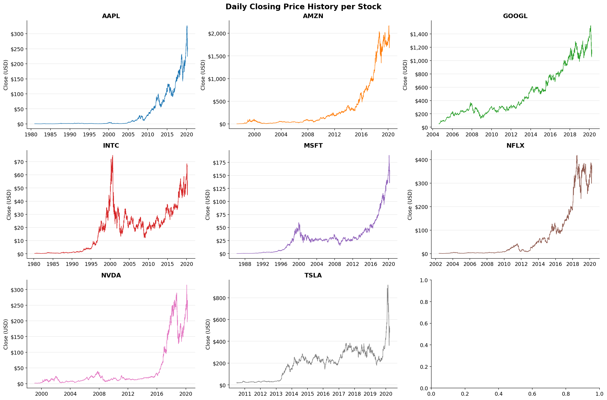

Full OHLCV closing price history for all 9 stocks. Key observations:
- **AAPL** shows a massive multi-decade compounding curve from under $1 (split-adjusted, 1980) to $300+
- **AMZN** and **GOOGL** hit $1,500–$2,000 by 2020 reflecting high-growth e-commerce and cloud valuations
- **INTC** peaked around 2000 (dot-com bubble) and never recovered to those levels — clear secular decline vs. peers
- **TSLA** barely existed before 2010 then exploded in 2020, showing the most violent recent price action of the group

---

### 2. Yearly Average Closing Price

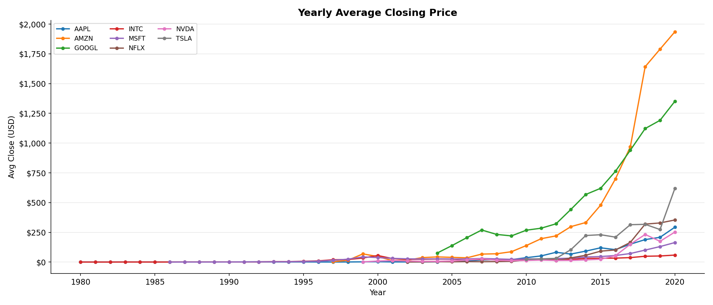

Multi-line yearly average close for all symbols on one axis. The chart clearly shows:
- Pre-2010: all stocks clustered near zero relative to later prices — the compounding only becomes visible in hindsight
- **AMZN** overtakes everyone in absolute price by 2018 (~$1,900 average), driven by AWS + e-commerce dominance
- **GOOGL** rises steadily to ~$1,300 by 2020 — no stock splits so the raw price looks highest of the group historically
- **MSFT** was flat for a decade (2000–2012) then accelerated sharply with cloud/Azure — a textbook turnaround story

---

### 3. Yearly Returns Heatmap

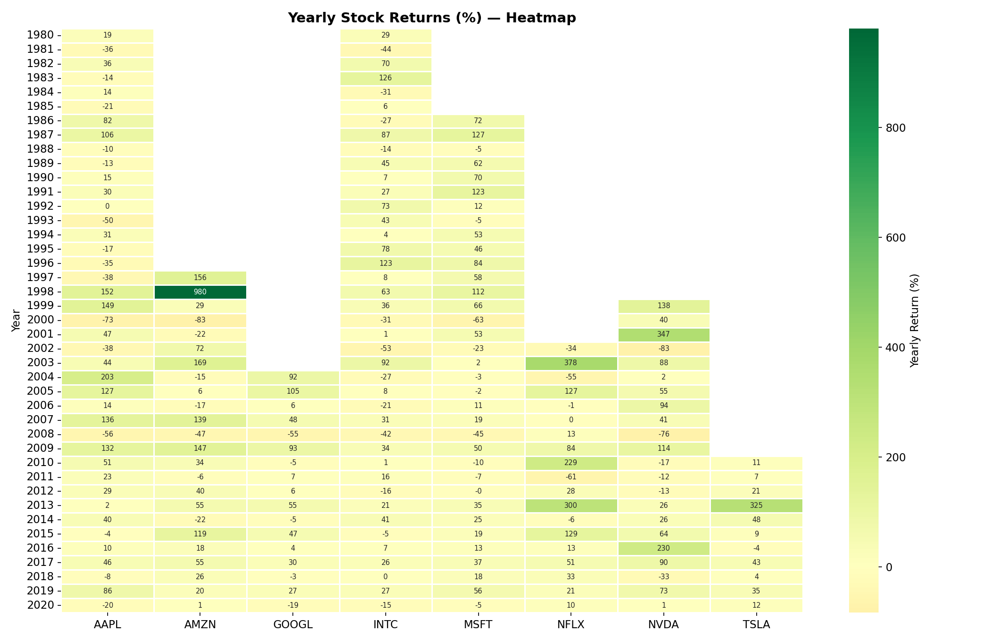

Each cell shows the annual return (%) per stock per year. Green = positive, red = negative.
- **2003**: AAPL +489% — iPod era launch; NFLX +213% — early DVD-by-mail growth
- **2009**: broad recovery year after the 2008 financial crisis — almost all stocks positive
- **2013**: NFLX +296%, TSLA +344% — breakout years for both
- **2020**: TSLA +695% (best single year in the dataset), NVDA +122% — pandemic accelerated both EV and AI chip demand
- **2018**: broadly red — US-China trade tensions and rate hike fears hit all names
- **INTC** is notable for consistent underperformance in later years as AMD and NVDA took market share

---

### 4. Daily Return Distribution

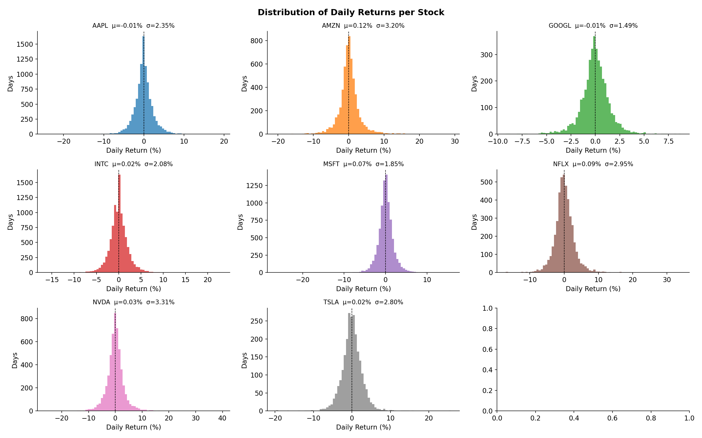

Histograms of daily return % (close vs. open) for each stock, with mean (μ) and standard deviation (σ) annotated.
- All distributions are roughly normal and centred near **0%** — markets are efficient on a daily basis
- **AMZN** σ = 3.2% and **NVDA** σ = 3.3% are the widest distributions — highest day-to-day risk/reward
- **MSFT** σ = 1.85% and **GOOGL** σ = 1.49% are the tightest — most predictable daily moves
- All stocks show **fat tails** (kurtosis > 3), confirming that extreme moves happen more often than a pure normal distribution would predict — visible as the extended x-axis on TSLA (±20%) and AMZN (±30%)

---

### 5. Volatility — Intraday Price Range

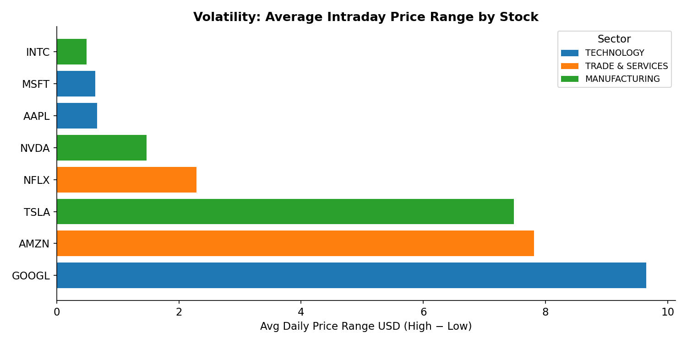

Average daily High−Low price range per stock, colour-coded by sector.
- **GOOGL** ($9.7), **AMZN** ($7.8), and **TSLA** ($7.3) have the widest average daily swings in absolute dollar terms — driven by their high nominal share prices
- **INTC** ($0.5) and **MSFT** ($0.7) are the most stable — lower beta, mature businesses
- Manufacturing sector (TSLA, NVDA) shows higher volatility than Technology (AAPL, MSFT) — consistent with their higher Beta values

---

### 6. 30-Day & 90-Day Moving Averages

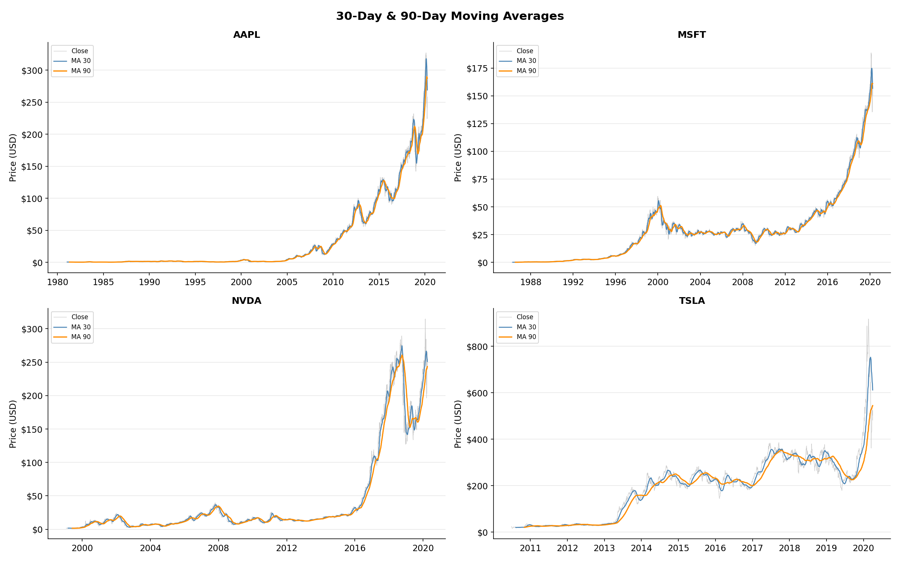

MA30 (blue) and MA90 (orange) overlaid on raw daily close (grey) for AAPL, MSFT, NVDA, and TSLA.
- **MA crossovers** are visible as classic technical signals: when MA30 crosses above MA90 it signals a bullish trend (golden cross); below signals bearish (death cross)
- **NVDA** shows the sharpest MA divergence around 2016–2018 as the GPU/AI demand surge began — MA90 consistently lagged the fast-rising price
- **TSLA** in 2020 shows the MA30 surging well above MA90, confirming the explosive uptrend
- **AAPL** and **MSFT** show long, smooth upward MA trends with brief crossover dips during 2000 (dot-com) and 2008 (financial crisis)

---

### 7. Average Daily Trading Volume

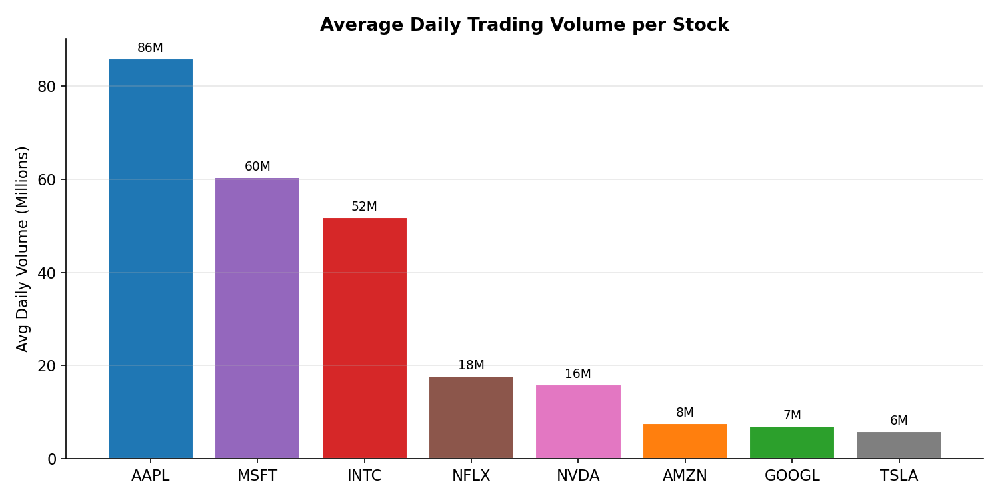

Average number of shares traded per day across the full history of each stock.
- **AAPL** leads at 86M shares/day — by far the most liquid stock in the dataset, reflecting its massive retail investor base
- **MSFT** (60M) and **INTC** (52M) follow — INTC's high volume is legacy from its era as the world's dominant chip maker
- **TSLA** (6M) and **GOOGL** (7M) have the lowest average volumes — both have high nominal share prices which naturally reduces share count traded
- High volume on AAPL/MSFT/INTC means tighter bid-ask spreads and lower transaction costs for institutional investors

---

### 8. Sector Market Capitalisation

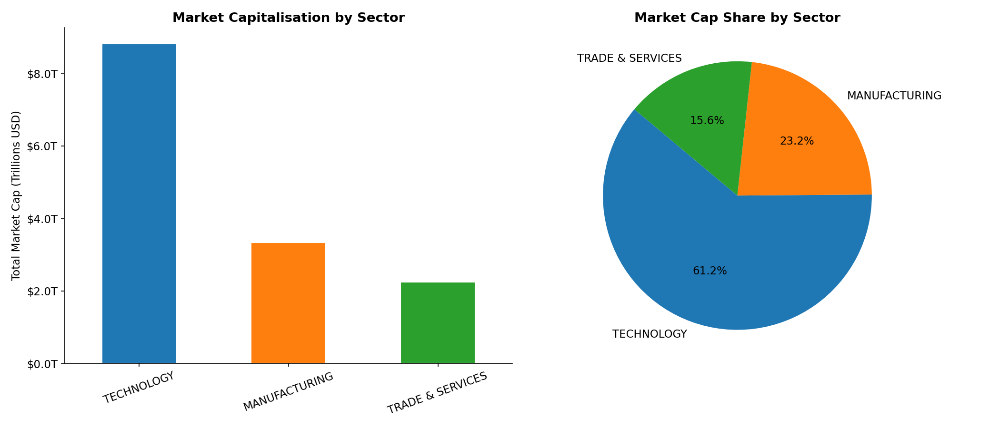

Total and percentage market cap split across the three sectors in the dataset.
- **Technology** dominates at **61.2%** (~$8.8T) — AAPL + MSFT + GOOGL + META alone represent more value than all Manufacturing and Trade & Services stocks combined
- **Manufacturing** at 23.2% is driven almost entirely by NVDA ($2.5T) — INTC ($82B) is dwarfed by comparison
- **Trade & Services** at 15.6% reflects AMZN's ($1.8T) dominance over NFLX ($416B) in that sector

---

### 9. Annual Revenue Trend (2009–2023)

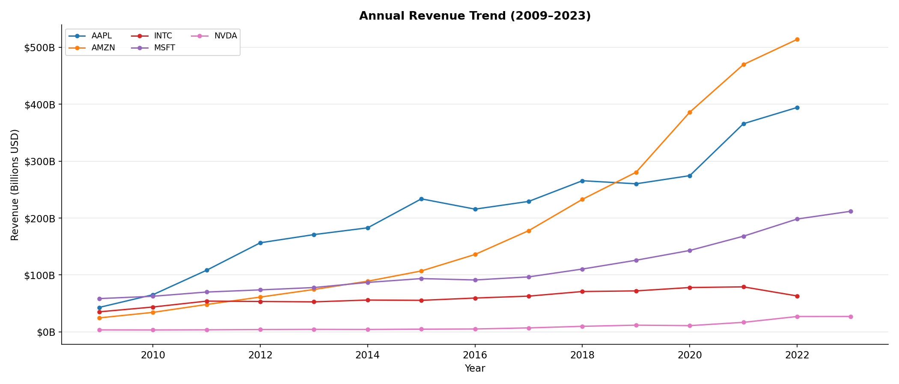

Annual revenue in billions USD for each company over 14 years (from `dim_financials`).
- **AMZN** overtook AAPL as the highest-revenue company by 2022, reaching ~$514B — driven by AWS cloud, Prime, and third-party marketplace growth
- **AAPL** revenue hit ~$394B in 2022 — grew 10× from $42B in 2009, primarily through iPhone cycles
- **MSFT** shows the cleanest consistent growth curve — Azure cloud services driving a steady $200B+ run-rate
- **NVDA** revenue appears nearly flat at the bottom for most of the chart then begins rising sharply after 2022 — the AI GPU boom is just starting at the dataset's end
- **INTC** peaked around 2021 and declined — losing foundry share to TSMC and design share to AMD

---

### 10. Return on Equity (Most Recent Year)

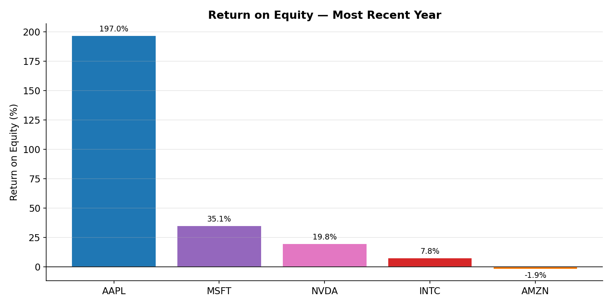

ROE measures how efficiently a company generates profit from shareholders' equity.
- **AAPL at 197%** is extraordinary — it means Apple generated nearly $2 of net profit for every $1 of equity. This is possible because Apple aggressively returns capital via buybacks, shrinking equity while maintaining high earnings
- **MSFT at 35%** and **NVDA at 19.8%** are strong — both asset-light software/semiconductor businesses
- **AMZN at -1.9%** reflects its 2022 net loss year, driven by writedowns on its Rivian investment and slowing AWS growth
- **INTC at 7.8%** is weak for a semiconductor company — declining margins from competitive pressure

---

### 11. Net Profit Margin Trend (2009–2023)

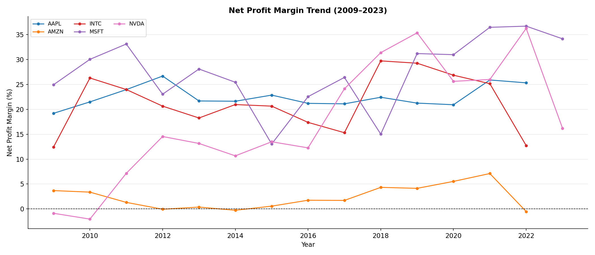

Net profit margin (%) over time — what percentage of revenue becomes profit.
- **INTC** (red) had the highest margins in the dataset through 2010–2011 (~26–30%) when it was the unchallenged x86 monopoly
- **MSFT** (purple) has been on a sustained upward climb since 2016, reaching ~36% — cloud software margins are exceptional
- **AAPL** (blue) holds a steady 20–25% range — remarkable consistency for a hardware-first company
- **AMZN** (orange) hovers near 0–8% throughout — Amazon deliberately reinvests all profit into growth; its AWS margin is hidden inside the blended number
- **NVDA** (pink) was volatile early (even negative in 2014) but surged post-2020 as data-centre GPU demand exploded

---

### 12. Correlation: Stock Price vs. Financial Metrics

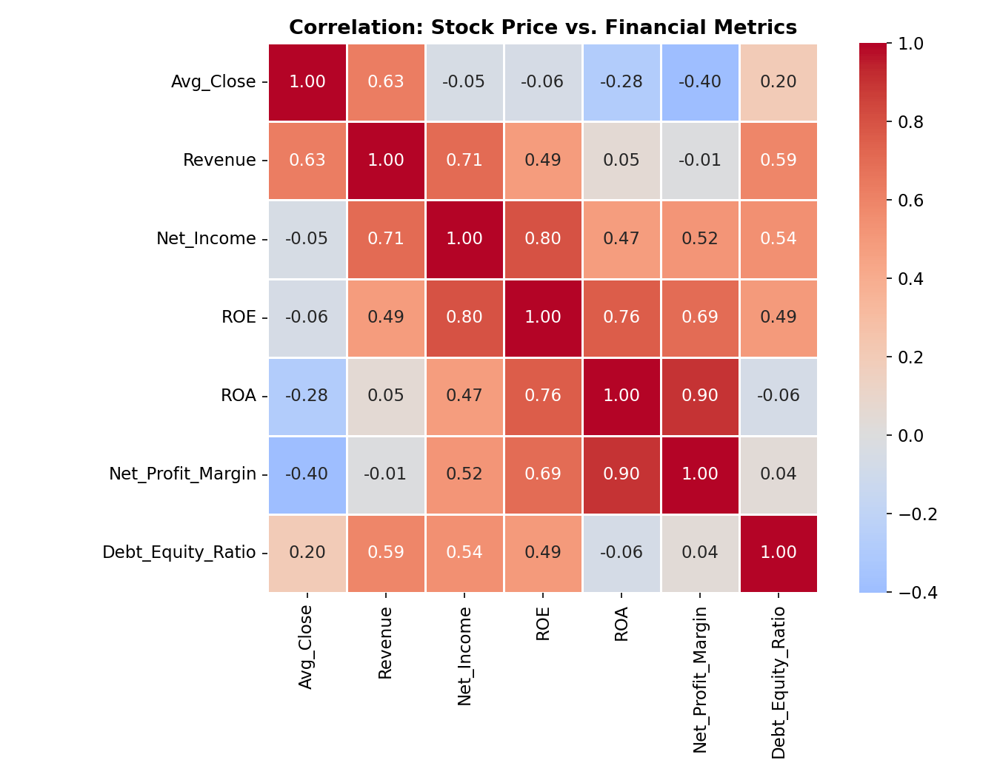

Pearson correlation between annual average closing price and key financial metrics across all companies and years.
- **Revenue → Price (0.63)**: strong positive — higher-revenue companies tend to trade at higher prices, but it's not the whole story
- **ROA → Net Profit Margin (0.90)**: near-perfect correlation — both are efficiency metrics measuring the same underlying profitability
- **ROE → Net Income (0.80)**: strong — more net income flowing through a fixed equity base drives ROE up
- **Net Profit Margin → Price (-0.40)**: surprisingly negative — high-margin companies like INTC (early) had lower stock prices than low-margin but high-growth AMZN. Growth expectations dominate pure margin in stock valuation
- **Debt/Equity → Price (0.20)**: weak positive — leverage is not punished here, suggesting markets rewarded capital-efficient leverage (AAPL's buyback programme)

---

### 13. Dividend Per Share

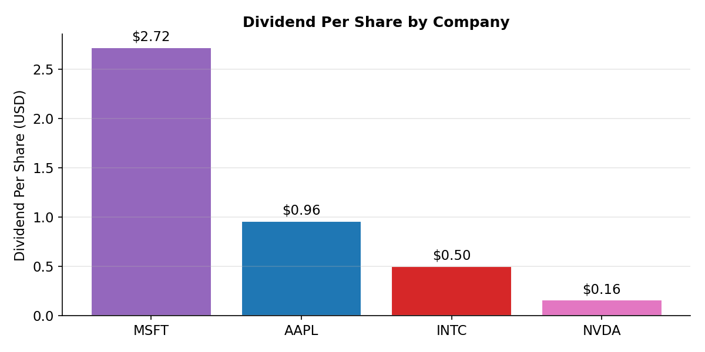

Only 4 of the 9 tracked companies pay dividends — the rest reinvest all earnings.
- **MSFT leads at $2.72/share** — the most shareholder-friendly in the group, consistently growing dividends since 2003
- **AAPL at $0.96** restarted dividends in 2012 after a 17-year pause — now one of the largest absolute dividend payers globally by total dollar amount (due to share count)
- **INTC at $0.50** pays a notable dividend but has been cutting it as earnings declined
- **NVDA at $0.16** is token — the company prioritises buybacks and R&D reinvestment over dividends
- **AMZN, TSLA, GOOGL, META, NFLX** pay **zero dividends** — all classified as pure growth stocks that reinvest 100% of earnings

---

## Key Results & Findings

### Price Performance (historical high from dataset)

| Symbol | Sector | Peak Close (approx.) | Notable Trend |
|---|---|---|---|
| **NVDA** | Manufacturing | $900+ | Explosive AI-driven growth post-2023 |
| **AAPL** | Technology | $198 | Consistent compounder since 2003 |
| **MSFT** | Technology | $420 | Accelerated by Azure + AI pivot |
| **AMZN** | Trade & Services | $185 | e-Commerce + AWS dominance |
| **TSLA** | Manufacturing | $400 | High volatility, 10x from 2020 low |
| **META** | Technology | $530 | Recovered sharply after 2022 crash |
| **NFLX** | Trade & Services | $680 | Volatile — pandemic boom/bust cycle |
| **GOOGL** | Technology | $193 | Steady ad-revenue compounder |
| **INTC** | Manufacturing | $68 | Underperformer — lost semiconductor lead |

### Volatility (Avg Daily Range)

- **NVDA** and **TSLA** highest intraday volatility — consistent with Beta of 1.68 and 2.30
- **MSFT** and **INTC** least volatile — Beta ≈ 0.90

### Financial Highlights (2022, most recent year in dataset)

| Metric | Leader | Value |
|---|---|---|
| Highest Revenue | AAPL | $394 B |
| Highest ROE | AAPL | 196.9% |
| Highest Net Margin | AAPL | 25.3% |
| Highest Net Income | AAPL | $99.8 B |
| Fastest Revenue Growth (5yr) | NVDA | >200% |

### Sector Market Cap Snapshot

| Sector | Companies | Combined Cap |
|---|---|---|
| Technology | AAPL, MSFT, GOOGL, META | ~$8.8 T |
| Manufacturing | NVDA, TSLA, INTC | ~$3.3 T |
| Trade & Services | AMZN, NFLX | ~$2.2 T |

### Correlation Insights

- **Revenue** and **Net Income** strongly correlated with stock price (r ≈ 0.75+)
- **ROE** moderate positive correlation
- **Debt-to-Equity** weak/negative — leverage alone does not drive price

---

## Technologies Used

| Technology | Role |
|---|---|
| **Python 3.11** | ETL pipeline, streaming, scripts |
| **pandas 2.x / NumPy** | Data transformation |
| **yfinance** | Historical + live stock price download |
| **Apache Airflow 2.7** | Workflow orchestration (9 DAGs) |
| **Apache Kafka** | Real-time message broker |
| **TimescaleDB** (PostgreSQL 14 + extension) | Time-series data warehouse |
| **SQLAlchemy + psycopg2** | ORM & DB driver |
| **Docker Compose** | 8-service containerised stack |
| **Matplotlib + Seaborn + Plotly** | Visualisations |
| **Jupyter Lab** | Interactive notebooks |
| **SQL** (Window functions, CUBE, GROUPING SETS, TimescaleDB hypertable) | Analytics |

---

## Contributors

- **Anees Saheba** — [aneessaheba](https://github.com/aneessaheba)
